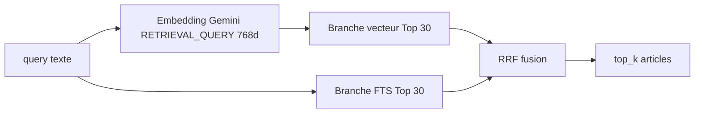

# Recherche d’articles — Code de l’urbanisme

Documentation des tools définis dans `recherche_articles.py`, exposés à l’agent PLU via Gemini function calling.

---

## Rôle dans l’agent

Deux portes d’entrée complémentaires dans le **corpus national** (~2 500 articles), distinctes des tools **PLU Argelès** (zonage, carte, règlement local) :

| Tool | Usage typique |
|------|----------------|
| `search_articles_urbanisme` | Question de **droit général** en langage naturel (définitions, procédures, notions juridiques) |
| `get_article_urbanisme_by_num` | **Citation ou vérification** d’un numéro précis (`L421-6`, `R151-1`, etc.) |

Le routage est guidé par les `DECL_*` (descriptions Gemini) et par le workflow du `SYSTEM_PROMPT_BASE` dans `chat.py` (points 5 et 6).

---

## Données en base

**Table** : `public.urbanisme_articles_embeddings`

| Colonne | Rôle |
|---------|------|
| `article_id` | Identifiant stable |
| `num` | Numéro Légifrance (`L421-6`, …) |
| `title`, `path_title` | Titres / fil d’Ariane |
| `resume` | Résumé LLM (densifie le sens pour la recherche) |
| `text_clean` | Texte officiel nettoyé |
| `embedding` | Vecteur **768d**, modèle `gemini-embedding-001`, normalisé L2 (ingestion via `reembed_avec_gemini.py`, `task_type=RETRIEVAL_DOCUMENT`) |
| `fts` | Colonne **tsvector** français pour la recherche full-text |

Les tools ne renvoient **jamais** `embedding` ni `fts` au LLM — seulement les colonnes lisibles (`_COLS`), pour limiter les tokens.

---

## Tool 1 — `search_articles_urbanisme`

### Entrées

```python
search_articles_urbanisme(db_config, query: str, top_k: int = 5)
```

- `query` : question utilisateur (ou reformulation thématique par Gemini)
- `top_k` : nombre d’articles finaux (défaut 5, conseillé ≤ 10)

### Pipeline (4 étapes)



#### 1. Embedding de la requête

- API : `gemini-embedding-001`
- `task_type="RETRIEVAL_QUERY"` (symétrique du `RETRIEVAL_DOCUMENT` utilisé à l’ingestion)
- `output_dimensionality=768`
- **Normalisation L2** obligatoire (cohérent avec l’index cosinus `<=>`)

#### 2. Branche sémantique (vecteur)

```sql
SELECT …, (embedding <=> %s::vector) AS dist
FROM urbanisme_articles_embeddings
WHERE embedding IS NOT NULL
ORDER BY embedding <=> %s::vector
LIMIT 30
```

- Opérateur pgvector `<=>` = **distance cosinus** (plus petit = plus proche)
- `CANDIDATES = 30` résultats avant fusion

#### 3. Branche lexicale (full-text)

```sql
SELECT …, ts_rank(fts, websearch_to_tsquery('french', %s)) AS rank
WHERE fts @@ websearch_to_tsquery('french', %s)
ORDER BY rank DESC
LIMIT 30
```

- Config **français** + `websearch_to_tsquery` (tolère formulations naturelles, guillemets, etc.)
- Utile pour termes juridiques exacts, acronymes, numéros partiels que le vecteur peut moins bien isoler

#### 4. Fusion RRF (Reciprocal Rank Fusion)

Pour chaque `article_id` présent dans au moins une branche :

\[
\text{score}(doc) = \sum_{\text{branche}} \frac{1}{RRF\_K + \text{rang}}
\]

- `RRF_K = 60` (constante standard : atténue l’écart entre rang 1 et rang 30)
- Un article **bien classé dans les deux listes** cumule deux contributions → souvent en tête
- Tri par score décroissant → **`top_k`** premiers
- Champs techniques `dist` / `rank` supprimés ; `rrf_score` ajouté (arrondi 5 décimales)

### Sortie

```json
{
  "articles": [
    {
      "article_id": "...",
      "num": "L421-6",
      "title": "...",
      "path_title": "...",
      "resume": "...",
      "text_clean": "...",
      "rrf_score": 0.03279
    }
  ],
  "count": 5,
  "error": null
}
```

En cas d’échec : `articles: []`, `error` explicite (requête vide, embedding, SQL).

---

## Tool 2 — `get_article_urbanisme_by_num`

### Entrées

```python
get_article_urbanisme_by_num(db_config, num: str)
```

### Logique

Lookup **exact** après normalisation du numéro côté SQL :

```text
upper(replace(replace(num, ' ', ''), '.', '')) = norm
```

Exemples équivalents : `L421-6`, `L. 421-6`, `l421 6` → `L421-6`.

Pas d’embedding, pas de RRF : une seule requête `SELECT` sur `_COLS`.

### Sortie

Même enveloppe `{ articles, count, error }`. Peut retourner **plusieurs lignes** si la base contient des doublons de numéro (peu probable, géré par `ORDER BY num`).

### Quand l’utiliser vs la recherche hybride

| Situation | Tool |
|-----------|------|
| « Qu’est-ce qu’un emplacement réservé ? » | `search_articles_urbanisme` |
| « Que dit l’article L421-6 ? » | `get_article_urbanisme_by_num` |
| Hybride puis citation | souvent **search** puis **get_by_num** sur les `num` trouvés |

---

## Intégration agent (`chat.py`)

1. Gemini appelle un tool → `_call_tool` dans `chat.py`
2. Le dispatch (`tools/__init__.py`) injecte `db_config` et exécute la fonction Python
3. Le résultat JSON est renvoyé au modèle via `Part.from_function_response`
4. Le front affiche les noms des tools dans la meta (`🔧 search_articles_urbanisme · …`)

Les résumés de tools pour les logs utilisent les zones / erreurs ; pour la recherche urbanisme, le summary générique est souvent `"ok"` ou `"erreur : …"`.

---

## Constantes (référence)

| Constante | Valeur | Rôle |
|-----------|--------|------|
| `EMBED_MODEL` | `gemini-embedding-001` | Aligné ingestion + requête |
| `EMBED_DIM` | `768` | Dimension pgvector |
| `CANDIDATES` | `30` | Profondeur par branche avant RRF |
| `RRF_K` | `60` | Lissage RRF |
| `top_k` (défaut) | `5` | Résultats exposés au LLM |

---

## Tests hors agent

```bash
cd …/plu_agent
python test_recherche.py
```

Valide connexion DB, embedding requête, pertinence RRF et variantes de numéros — **sans** passer par la boucle Gemini.

---

## Limites connues

- **Recherche hybride** : dépend de `embedding IS NOT NULL` et d’une colonne `fts` à jour ; articles sans texte embeddable peuvent être absents de la branche vecteur.
- **FTS** : si la requête ne matche aucun token indexé, seule la branche sémantique contribue au RRF.
- **get_by_num** : échec si le numéro n’existe pas en base ou si l’orthographe diverge trop de la normalisation (pas de fuzzy match).
- **Coût** : chaque `search_*` = 1 appel embedding Gemini + 2 requêtes SQL.

---

En résumé : **`search_articles_urbanisme`** combine **sens** (vecteur cosinus) et **mots** (FTS français), fusionne par **RRF**, puis livre les articles complets au LLM ; **`get_article_urbanisme_by_num`** est le raccourci **déterministe** quand le numéro d’article est connu.